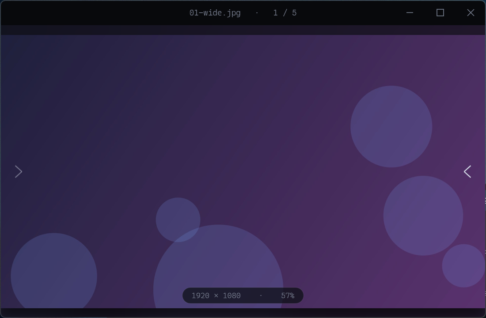

<div align="center">

# Lux

**Un visor de imágenes nativo, dark y minimalista para Windows.**

Win32 puro + Direct2D + WIC. Sin frameworks, sin runtime, sin dependencias. Un solo `.exe` portable de ~360 KB que abre al instante.




</div>

---

## ✨ Qué es

**Lux** es el hermano de bajo nivel de [Lumen](https://github.com/agustinyarrus/lumen): la misma estética
oscura y sin distracciones, pero escrito en **C++ nativo** contra la API de Windows. La imagen se decodifica
con **WIC** (el motor del sistema) y se dibuja con **Direct2D/DirectWrite**, acelerado por GPU. La ventana es
**frameless** —la barra de título la dibuja la propia app—, con zoom al cursor suave y un fondo _ambient_
desenfocado. **Funciona 100% offline** y no carga ningún runtime: es Win32 a secas.

## 🖼️ Formatos

Decodificados por **WIC** (con los códecs del sistema / Microsoft Store):

> `jpg` · `jpeg` · `png` · `gif` · `bmp` · `tiff` · `ico` · `dds` · `jxr` / `hdp` · `webp`* · `heic`* · `avif`* · `raw`* (`cr2` `nef` `arw` `dng` …)

Y los que WIC no trae, por **stb_image** integrado:

> `tga` · `hdr` · `ppm` · `pgm` · `pbm` · `pnm` · `pic` · `psd`

<sub>* requieren la extensión de códec correspondiente instalada (gratis desde Microsoft Store).</sub>

## 🎛️ Características

- **Render Direct2D** con interpolación bicúbica de alta calidad al reducir y _nearest_ al hacer pixel-peeping (≥300 %).
- **Zoom al cursor** con la rueda, paneo al arrastrar, doble clic para alternar ajuste ↔ 100 %.
- **Fondo _ambient_**: una versión desenfocada de la imagen llena el escenario (efecto Gaussian de D2D).
- **Navegación por carpeta** en orden natural (`foto2` antes que `foto10`), con índice _n / total_.
- **Cromo que se autooculta**: barra y HUD se desvanecen tras unos segundos de inactividad y el cursor desaparece.
- **Frameless real**: barra de título propia, botones dibujados a mano, esquinas redondeadas y borde oscuro de Windows 11.
- **Arranque sin _flash_**: la ventana nace oscura desde el primer pixel.
- Arrastrar y soltar, pantalla completa, y un `.exe` portable que no deja nada instalado.

## ⌨️ Atajos

| Tecla                       | Acción                         |
|-----------------------------|--------------------------------|
| `←` `↑` · `→` `↓` `Espacio`  | Imagen anterior / siguiente    |
| `rueda`                     | Zoom al cursor                 |
| `doble clic`                | Ajuste ↔ detalle (100 %)       |
| `+` / `-` / `0` / `1`       | Zoom in / out / ajustar / 100 %|
| `Inicio` / `Fin`            | Primera / última imagen        |
| `F` / `F11`                 | Pantalla completa              |
| `Esc`                       | Salir de pantalla completa / cerrar |
| `Ctrl O`                    | Abrir                          |

## 📦 Compilar

> Requiere **Visual Studio 2022** (o Build Tools) con el _Desktop development with C++_ y el Windows 10/11 SDK.

```powershell
.\gen-icon.ps1     # genera lux.ico (sparkle azul-noche). Correr con Windows PowerShell 5.1.
.\build.ps1        # compila lux.exe (release, /O2 /MT, sin consola, con icono y manifest)
.\build.ps1 -Run   # compila y abre una imagen de prueba
.\build.ps1 -Dbg   # build con símbolos + consola para diagnóstico
```

El resultado es un único **`lux.exe`** portable. Luego:

```powershell
lux.exe foto.jpg
```

o asocialo en _Abrir con…_ y usalo como visor por defecto.

## 🏗️ Arquitectura

| Pieza                  | Rol                                                                            |
|------------------------|--------------------------------------------------------------------------------|
| `lux.cpp`              | Todo: ventana frameless, decodificación WIC+stb, render D2D, input, navegación |
| `third_party/stb_image.h` | Decodificador _header-only_ para los formatos que WIC no cubre              |
| `lux.manifest`         | DPI _per-monitor v2_, common controls, code page UTF-8                          |
| `lux.rc`               | Icono + versión + manifest embebidos                                           |
| `gen-icon.ps1`         | Genera `lux.ico` multi-resolución con System.Drawing                            |
| `build.ps1`            | Localiza MSVC (vcvars) y compila con `cl` + `rc`                                |

Toda la decodificación pasa por una cadena con _fallback_: los formatos típicos van por **WIC**
(acelerado, con orientación y códecs del sistema); los raros (`ppm`, `tga`, `hdr`, `psd`…) por **stb_image**;
si una vía falla, se intenta la otra.

## 📄 Licencia

MIT © Agustín Yarrus — ver [LICENSE](LICENSE).
