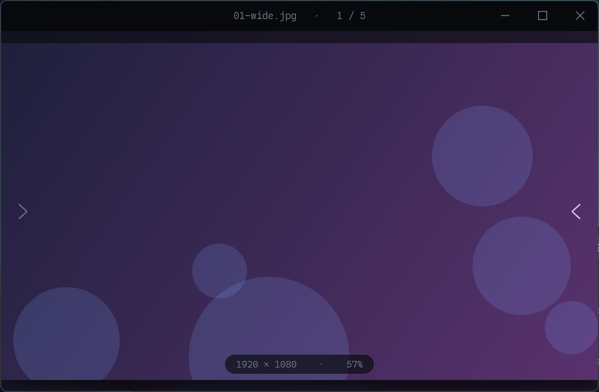

<div align="center">

# Lux

**Un visor de imágenes nativo, dark y minimalista para Windows.**

Win32 puro + Direct2D + WIC. Sin frameworks, sin runtime, sin dependencias. Un solo `.exe` portable que abre al instante — y que le entra a **171 extensiones**.


[](https://github.com/agustinyarrus/lux/releases/latest)
[](https://github.com/agustinyarrus/lux/releases)



</div>

---

## ✨ Qué es

**Lux** es el hermano de bajo nivel de [Lumen](https://github.com/agustinyarrus/lumen): la misma estética
oscura y sin distracciones, pero escrito en **C++ nativo** contra la API de Windows. La imagen se decodifica
con **WIC** (el motor del sistema) y se dibuja con **Direct2D/DirectWrite**, acelerado por GPU. La ventana es
**frameless** —la barra de título la dibuja la propia app—, con zoom al cursor suave y un fondo _ambient_
desenfocado. **Funciona 100% offline** y no carga ningún runtime: es Win32 a secas.

## 🖼️ Formatos

Lux abre prácticamente todo: **171 extensiones**. **Vectorial**, nítido a cualquier zoom
(SVG con nanosvg, metarchivos con GDI):

> `svg` · `svgz` (gzip) · `emf` · `wmf` · `emz` · `wmz`

**Por WIC**, con los códecs del sistema / Microsoft Store:

> `jpg` · `jpeg` · `png` · `apng` · `gif` · `bmp` · `tiff` · `ico` · `cur` · `ani` · `dds` · `jxr` / `hdp` · `mpo` / `jps` · `webp`* · `heic`* / `heif`* · `avif`* · `jxl`* · `jp2`* / `j2k`*

**Fotos RAW** — con el códec de la cámara si está instalado y, si no, **extrayendo la vista
previa JPEG que el archivo lleva adentro**: así abre casi cualquier RAW sin instalar nada.

> `cr2` `cr3` `crw` `nef` `nrw` `arw` `sr2` `srf` `dng` `orf` `rw2` `raf` `srw` `pef` `3fr` `iiq` `x3f` `mrw` `kdc` `dcr` `erf` `mef` `mos` `k25` `gpr` `raw` … (39 en total)

Y respeta la **orientación EXIF**: las fotos del celular salen derechas, no acostadas.

**Por decoders propios integrados** (header-only, sin dependencias):

> `qoi` · `exr` (OpenEXR HDR) · `pcx` (1/2/4/8 bits) · `pfm` · `ff` (farbfeld) · `ras` / `sun` (crudo **y** RLE) · `sgi` / `rgb` / `bw` · `wbmp` · `pam` · `xbm` · `xpm` · `tga` · `hdr` · `ppm` / `pgm` / `pbm` / `pnm` (binario **y** ASCII) · `pic` · `psd`

**Archivos de editores por capas** — se compone o se saca la imagen ya aplanada:

> `xcf` (GIMP: compone a mano las capas visibles, v0 a v13) · `ora` (OpenRaster) · `kra` (Krita) · `sketch` · `procreate`

**Otras plataformas, retro y cine:**

> `icns` (macOS) · `iff` / `ilbm` / `lbm` / `acbm` (Amiga, con **HAM** y **EHB**) · `mac` / `pntg` (MacPaint) · `pi1`–`pi3` y `pc1`–`pc3` (**Degas** y Degas Elite, Atari ST) · `neo` (NEOchrome) · `scr` (**ZX Spectrum**) · `koa` / `kla` (**C64 Koala**) · `img` / `ximg` (GEM) · `tim` (**PlayStation**) · `pix` / `als` (Alias) · `pcd` (Kodak **Photo CD**) · `dcx` (PCX multipágina) · `xwd` (X Window Dump) · `dpx` · `cin` (Cineon, con la curva log del negativo)

**Texturas de juegos** — con los bloques **BC1…BC5** (DXT1/3/5, RGTC) descomprimidos a mano:

> `dds` · `vtf` (Source de Valve) · `ktx` (OpenGL)

**Científicas y médicas:**

> `fits` (astronomía, con estiramiento automático de niveles) · `dcm` / `dicom` (VR explícita e implícita, ventana/nivel, RGB, YBR y JPEG encapsulado)

**Y encima:**

> el **icono** de un `exe` · `dll` · `ocx` · `cpl` · `icl` (se queda con el más grande) · y cualquiera de los de arriba **comprimido con gzip** (`foto.ppm.gz`)

<sub>Si el formato de imagen existe, es muy probable que Lux lo abra.</sub>

<sub>* webp/heic/avif/jxl/jp2 usan las extensiones de códec de Windows (gratis en Microsoft Store; en Windows 11 suelen venir preinstaladas). Si falta alguna, Lux te avisa cuál instalar.</sub>

## 🎛️ Características

- **Ventana pegada a la imagen** o **tamaño libre**: un toggle en la barra de título (o la tecla `W`) elige si cada imagen ajusta la ventana a su tamaño, o si conservás el tuyo. La preferencia y el tamaño/posición se **recuerdan entre sesiones**.
- **Texto nítido de verdad**: ClearType real sobre un target opaco, hinting GDI-clásico y el peso de Cascadia elegido por el **tamaño final en píxeles** (más cuerpo cuanto más chica la letra) — cada asta cae en una columna de píxeles, en cualquier DPI.
- **Píxel-exacto al 100 %**: la imagen se ancla en píxel entero, así que a escala real no se remuestrea nada.
- **Render Direct2D** con interpolación bicúbica de alta calidad al reducir y _nearest_ al hacer pixel-peeping (≥300 %).
- **Zoom al cursor** con la rueda, paneo al arrastrar, doble clic para alternar ajuste ↔ 100 %.
- **Fondo _ambient_**: una versión desenfocada de la imagen llena el escenario (efecto Gaussian de D2D).
- **Orientación EXIF** aplicada al vuelo: las fotos de cámara y celular se ven derechas.
- **Navegación por carpeta** en orden natural (`foto2` antes que `foto10`), con índice _n / total_.
- **Cromo que se autooculta**: barra y HUD se desvanecen tras unos segundos de inactividad y el cursor desaparece.
- **Frameless real**: barra de título propia, botones dibujados a mano, esquinas redondeadas y borde oscuro de Windows 11.
- **Arranque sin _flash_**: la ventana nace oscura desde el primer pixel.
- Arrastrar y soltar, pantalla completa, y un `.exe` portable que no deja nada instalado.

## ⌨️ Atajos

| Tecla                       | Acción                         |
|-----------------------------|--------------------------------|
| `←` `↑` · `→` `↓` `Espacio`  | Imagen anterior / siguiente    |
| `rueda`                     | Zoom al cursor                 |
| `doble clic`                | Ajuste ↔ detalle (100 %)       |
| `+` / `-` / `0` / `1`       | Zoom in / out / ajustar / 100 %|
| `Inicio` / `Fin`            | Primera / última imagen        |
| `F` / `F11`                 | Pantalla completa              |
| `Esc`                       | Salir de pantalla completa / cerrar |
| `Ctrl O`                    | Abrir                          |
| `W`                         | Ventana pegada a la imagen (on/off) |

## ⚙️ Configuración

Lux guarda sus preferencias en **`%APPDATA%\Lux\config.json`** (se crea solo). Lo podés editar a mano o usar el toggle de la barra de título (el ícono de marco, se pone azul cuando está activo):

```json
{
  "fitWindowToImage": false,
  "maximized": false,
  "winX": 100, "winY": 100,
  "winW": 1100, "winH": 720
}
```

- **`fitWindowToImage: true`** — al abrir o navegar, la ventana toma el tamaño de la imagen (limitada al monitor) y la muestra a 100 %. Es la opción "ventana pegada".
- **`fitWindowToImage: false`** — la ventana conserva el tamaño y la posición que vos le des; se recuerdan entre sesiones (`winX/Y/W/H`, `maximized`).

## 📦 Compilar

> Requiere **Visual Studio 2022** (o Build Tools) con el _Desktop development with C++_ y el Windows 10/11 SDK.

```powershell
.\build.ps1        # compila lux.exe (release, /O2 /MT, sin consola, con icono y manifest)
.\build.ps1 -Run   # compila y abre una imagen de prueba
.\build.ps1 -Dbg   # build con símbolos + consola para diagnóstico
```

Los iconos son assets curados del repo: **`lux.ico`** (icono de la app, embebido en el `.exe`) y
**`lux-file.ico`** (icono de los archivos asociados, vía el ProgID `Lux.Image`). El script opcional
`.\gen-icon.ps1` regenera el sparkle azul-noche original y **sobreescribe `lux.ico`**.

El resultado es un único **`lux.exe`** portable. Luego:

```powershell
lux.exe foto.jpg
```

o asocialo en _Abrir con…_ y usalo como visor por defecto.

## 🏗️ Arquitectura

| Pieza                  | Rol                                                                            |
|------------------------|--------------------------------------------------------------------------------|
| `lux.cpp`              | Todo: ventana frameless, decodificación (WIC + stb + SVG + GDI + los propios), render D2D, input, navegación |
| `third_party/`         | Decoders _header-only_: `stb_image`, `nanosvg` (SVG), `qoi`, `tinyexr` (EXR, reusa el zlib de stb), `exotic.h` (pcx/farbfeld/pfm/sun/sgi/ilbm/icns/dpx/xwd/xpm…), `retro.h` (Atari/C64/ZX/GEM/PSX/PhotoCD), `sci.h` (FITS y DICOM), `texture.h` (DDS/VTF/KTX y BC1..BC5), `xcf.h` (GIMP), `unpack.h` (gzip y ZIP, sobre el mismo zlib) |
| `tests/`               | `gen_samples.py` fabrica una imagen de referencia en cada formato y `run.ps1` compila y corre los asserts contra ella (405 asserts); `smoke.ps1` abre las 47 muestras con el `lux.exe` real |
| `lux.manifest`         | DPI _per-monitor v2_, common controls, code page UTF-8                          |
| `lux.rc`               | Icono + versión + manifest embebidos                                           |
| `lux.ico` / `lux-file.ico` | Iconos curados (16→256, 32-bit): la app y los archivos asociados (ProgID `Lux.Image`) |
| `gen-icon.ps1`         | Regenera el `lux.ico` original (squircle) con System.Drawing — opcional           |
| `build.ps1`            | Localiza MSVC (vcvars) y compila con `cl` + `rc`                                |

Toda la decodificación pasa por una cadena con _fallback_ que elige por extensión y termina
probando por _magic_: los formatos típicos van por **WIC** (acelerado, con los códecs del sistema
y la orientación EXIF aplicada con un `IWICBitmapFlipRotator`); los raros (`ppm`, `tga`, `hdr`,
`psd`…) por **stb_image**; los exóticos por los decoders propios; los metarchivos y los iconos de
ejecutables por **GDI**; y si nada de eso funciona, se busca un **JPEG incrustado** en el archivo
(que es exactamente lo que hace andar a los RAW sin códec). Los contenedores (`svgz`, `gz`, `ani`,
`ora`, `kra`, `sketch`, `procreate`) se desenvuelven primero con `unpack.h` y recién después se
decodifica lo que traen adentro.

Para correr los tests de los decoders propios (necesita Python para fabricar las muestras):

```powershell
cd tests
.\run.ps1     # compila y corre los asserts contra las muestras
.\smoke.ps1   # abre cada muestra con lux.exe de verdad (usa un %APPDATA% aparte)
```

## 📄 Licencia

MIT © Agustín Yarrus — ver [LICENSE](LICENSE).
